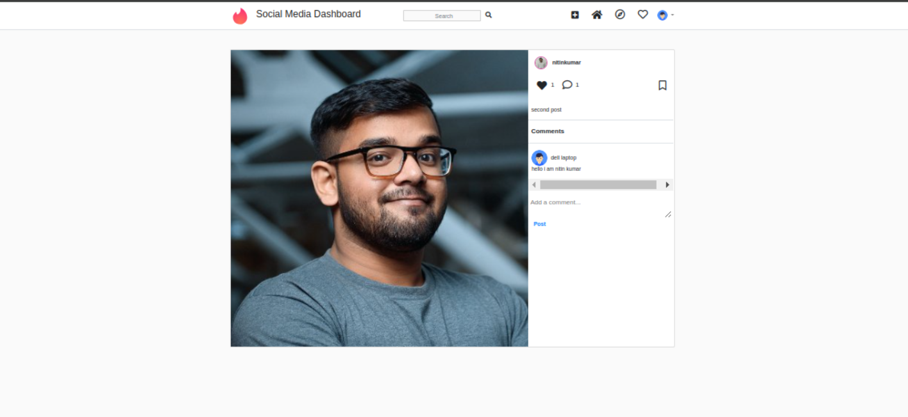

# *Welcome to Social Media Dashboard!*

## Dashboard dived into 3 sections

- Authuntication 
- User Profile
- Post

### 1. Authuntication

Create to  **auth_app** to perform   Authutication  functionlites

- Register
  - Verify Email
  - username 
  - password
  - confirm password
  - full name 

  

- Login
  - username & email
  - password

  

- Logout
  - Delete cookie  and redirect to login page

- Forget Password
  - Verify Email which user login 
  - Send email to user with link to reset password
  - User click link to reset password
  - User enter new password and confirm password

  - Update password

   

### 2. User Profile

Create to  **user** App to perform   User Profile  functionlites

- View user progile

  - edit user profile 

  - showing save and posted post with like and comment 
  
  - showing  user follower and  following  

  - showing the user setting 

     - edit profile

      - change password  

      - logout
    
   

- Update user profile 
  
    - Full name

    - Email

    - Username

    - Add Profile image
    
    etc

    

### 3. Post

Create to  **Core** App  to perform   Post  functionlites

- Create post

  - Add post image

  - Add post description

  

- showing the image 
 
  - showing the all post in social media app

  

- ### *Like and dislike showing when click on go to post*
--- 
  - when click go to post

     - showing the related post of selected post

     - showing the comment

     - total like of post 

     

### Functionlites is working.  this porject is not completed yet. this is first version of this porject. and 
### further. i will add more features to this porject.

*Created by:*
### *Nitin kumar*

*Linkeden*:
### www.linkedin.com/in/nitin-kumar-489308238*

  

    

 

